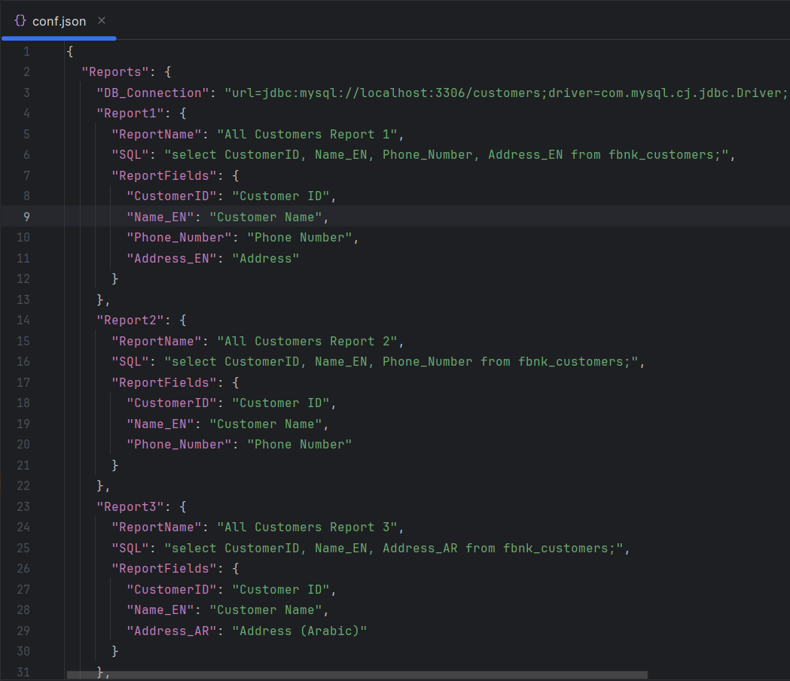

# Dynamic Report Builder
Dynamic Report Builder Web Application

## Overview
In many business there is requirements to represent data from relational database to visual web page 
for business user, and this is very systematic process that may consume developer time without learning 
or achieving something new. Dynamic display of a data base query will help very much on that.

### Prerequisites
- [Git](https://git-scm.com/downloads)
- [JDK 17](https://www.oracle.com/java/technologies/javase/jdk17-archive-downloads.html)
- [Apache Maven](https://maven.apache.org/download.cgi?.)

### Configuration
- Run local database
- Configure the input configuration file

### Installation and How to Run
1. Clone the repository:
    ```bash
    git clone https://github.com/reda-mohsen/Dynamic_Report_Builder.git
    ```
2. Move to project directory:
    ```bash
    cd Dynamic_Report_Builder
    ```
3. Edit application properties to specify configuration file path: (default: "conf.json")
    ```bash
    notepad src/main/resources/application.properties
    ```
4. Build the application:
   ```bash
    mvn clean package
    ```
4. Run the application:
   ```bash
   java -jar target/report-0.0.1-SNAPSHOT.jar
    ```

## Screenshots
Input configuration file:


Output of report 1:


Output of report 2:


Output of report 3:


Output of report 4:


